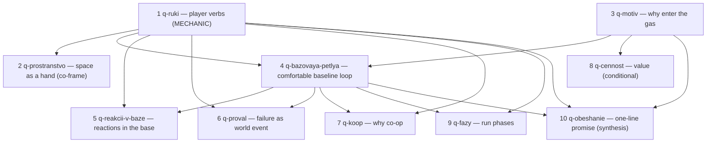

# Core Concept Rebuild — Question Map v0.1

Status: owner-signed cartography map, NOT canon, no gameplay answer frozen.
Approved in: `s-cartography-core-concept-rebuild-001` (CALL c-cartography-core-concept-rebuild-001).
Owner words: `А` (= «Подписываю карту»).
Signed compact queue lives in canon repo `QUEUE.md`. This file is the full-field version + gap-rule anchor.

## 1. Cluster

Cluster: core game concept rebuild from current reality (fixed foundations first).

Anchor question:
  Какая игра собирается из настоящего газ-сима, реакций и изменяемого пространства — без пузыря/этажа/добычи/экономики как центра по умолчанию?

Why this map exists:
  Owner stopped the old Bubble-first Mechanics-Workbench route (correction 2026-07-08, re-confirmed 2026-07-09). Rebuild must start from the three fixed foundations, separate them from everything now in draft, and pick the smallest first blocking question without freezing canon.

Fixed foundations (constitution, not questioned here):
  - настоящая симуляция газа как центр;
  - реакции газов (системный материал, но комфортная база их НЕ требует — П1);
  - разрушаемое/изменяемое пространство.

Draft-until-re-approved:
  bubble, floor loop, carry, tools, economy, `ЛЁГКИЕ`, roster, roles, title, old canon.

Current route decision:
  First next session = `local/canon-forge` (Кузница v2) on node 1 `q-ruki`, MECHANIC mode; node 2 `q-prostranstvo` admissible as co-frame.

## 2. Accounting table (every draft piece placed or parked — nothing lost)

| Source idea / material | Disposition | Map home | Reason |
|---|---|---|---|
| gas sim / reactions / changeable space | fixed foundation | constitution | Owner-fixed; not a question. |
| player verbs (глаголы) | placed | Node 1 | Earliest blocker; everything downstream is verbs in time. |
| building as gas tool (doors/vents/breach/jets) | placed | Node 2 | Co-frame to verbs: editing space = editing gas. |
| motive / why enter the gas | placed | Node 3 | Motive-first would drag extraction back to center prematurely. |
| comfortable baseline run (no reaction-chase) | placed | Node 4 | Direct expression of П1. |
| reactions in the base game | placed | Node 5 | Foundation, but base must not require chasing them (П1). |
| failure as world event | placed | Node 6 | Constitution pillar 4: failure changes the world, not a screen. |
| co-op necessity | placed | Node 7 | Pillar 1 + mechanic-lenses anti-solo gate. |
| value / what is valuable | placed (conditional) | Node 8 | Opens only if motive (3) = value. |
| run phases (quiet→scout→active) | placed | Node 9 | Awakening triggers from pitch are material here. |
| one-line promise | placed (synthesis) | Node 10 | Synthesis after 1+3+4; promise-first = whole-concept compare (forbidden). |
| Пузырь mechanic (ковш/надув/мембрана) | parked | parking | Candidate ANSWER to «взять часть» in Node 1; not a question itself. |
| carry / two-body co-op | parked | parking | Wakes with Node 1 if take/carry verb survives. |
| tools / instrument list | parked as sockets | parking | Honest placeholders until verbs exist. |
| economy + `ЛЁГКИЕ`/`Вахта` | parked | parking | Wakes with Nodes 4 + 8. |
| bestiary (Тихоня…Хор) | parked | parking | Behavior examples, not roster; wakes with Node 4. |
| role roster | parked | parking | Wakes with Node 7; "roles from hands" already in constitution. |
| title `ОНО ДЫШИТ` | parked | parking | Working label; follows proven core (Node 10 + greybox). |
| old canon / maps | salvage | parking | Evidence only; returns on live-question need. |
| gas visual style | out of scope | track g-7e15 | Lives in the VISUAL track, not pulled here. |
| old QUEUE parking (voice/DSP, seeds, persistent floor, iron-watch, run artifact, field-brewing, contract types, trap doors) | parked | parking | Carried forward verbatim. |

## 3. Graph (dependency order)

## 4. Nodes

### Node 1 — q-ruki — Руки игрока

plain_question:
  Какими 1–3 глаголами игрок трогает газовый мир в моменте?
why_it_matters:
  Инструменты, перенос, кооп, фазы — всё это глаголы во времени. Начать не с глаголов = снова строить поверх невыясненного действия (ошибка «запузырить»).
answer_shape: loop_spine
status: ready
dependency_type: hard_prerequisite
blocks: [Node 2, Node 4, Node 5, Node 6, Node 7, Node 9]
do_not_solve_here: [инструменты-список, пузырь-механика, ростер, экономика, название, финальный тюнинг]
needs_anchor: verbal_scene
confusion_traps:
  - глагол назван словом-ярлыком без посекундного следствия («запузырить»);
  - глагол, которого сим не умеет (движок сверх запланированного — П3);
  - каталог чужих механик винегретом вместо 1–3 наших.
mode: MECHANIC (SESSION.md: сначала таблица глаголов → посекундный цикл с разнесёнными игроками → линзы)
forge_handoff:
  plain_question: "Из того, что сим уже умеет, какие 1–3 глагола — руки игрока в базовой игре?"
  why_now: "Самый ранний блокер: без глаголов любой перенос/инструмент/кооп — слово, не механика."
  must_decide: "1–3 базовых глагола (черновик) + таблица глагол/объект/ввод/видимое следствие в секундах/сколько игроков; отклонённые кандидаты."
  must_not_decide: "инструменты, пузырь, ростер, экономику, мету, название."
  parent_locks: "газ = честная физика без мозгов; простой вход (глагол знаком телом); нового движка — ноль сверх запланированной дороги; линзы механик BINDING."
  first_owner_question: "Что игрок физически ДЕЛАЕТ руками с газом в первую же секунду?"
  return_to_graph_if: "глагол не переводится в посекундное следствие; глагол требует нового движка; вопрос распадается на «читать» vs «действовать»."

### Node 2 — q-prostranstvo — Пространство как рука

plain_question:
  Что игрок делает со зданием (двери, проломы, струи, тепло/холод) как частью базовой игры?
why_it_matters:
  Изменяемое пространство — основание. Если правка пространства = правка газа, то часть «рук» игрока живёт в стенах, а не только в самом газе.
answer_shape: scenario_grammar
status: ready
dependency_type: co_frame
blocks: [route control, tool sockets, Node 6 failure surfaces]
do_not_solve_here: [список инструментов, дизайн уровней, финальные модели дверей/струй]
needs_anchor: verbal_scene
confusion_traps:
  - «инженерный симулятор на входе» (помпы/вентильные головоломки как ядро — в НЕТ-списке);
  - здание как статичный фон;
  - список устройств раньше глагола.
forge_handoff:
  plain_question: "Какие правки пространства — часть базовой игры, а не поздний инструмент?"
  why_now: "Со-рамка к глаголам: в нашей игре пространство и газ — одна рука."
  must_decide: "какие space-правки базовые (дверь/пролом/струя/тепло-холод) как sockets, не как каталог."
  must_not_decide: "финальный тулсет, прогрессию, дизайн уровней."
  parent_locks: "разрушаемое/изменяемое пространство = основание; НЕ инженерный симулятор на входе."
  first_owner_question: "Какая одна правка здания сильнее всего меняет газ прямо сейчас: дверь, пролом, струя или температура?"
  return_to_graph_if: "space-правки превращаются в обслуживание/головоломку-ядро; зависят от неназванного глагола."

### Node 3 — q-motiv — Мотив

plain_question:
  Зачем игроки лезут в газ?
why_it_matters:
  Мотив задаёт, что значит «успешный заход» (узел 4) и есть ли вообще ценность (узел 8). Но мотив-первым тащит «добычу» в центр до глаголов.
answer_shape: invariant
status: downstream
dependency_type: downstream
blocks: [Node 4, Node 8, Node 10]
do_not_solve_here: [форма ценности, экономика, мета, цены]
needs_anchor: verbal_scene
confusion_traps:
  - молчаливое «добыча ценности» как единственный мотив (столп 4 — это фильтр, не ядро-по-умолчанию, П2);
  - мотив как экран-квота от корпорации в лоб (в негативном промпте).
forge_handoff:
  plain_question: "Зачем игроки заходят: ценность из газа, задание, спасение, исследование — или другое?"
  why_now: "Нужен до определения «успешного захода», но после глаголов."
  must_decide: "1 главный мотив (или честное «несколько») как инвариант; отклонённые."
  must_not_decide: "форму ценности, экономику, мету."
  parent_locks: "если ценность есть — она из газа (П2); провал меняет мир; НЕ квота-в-лоб."
  first_owner_question: "Что игроки получают, ради чего терпят газ?"
  return_to_graph_if: "мотив требует экономики; распадается на несколько несовместимых."

### Node 4 — q-bazovaya-petlya — Базовая комфортная петля

plain_question:
  Как выглядит обычный успешный заход БЕЗ погони за реакциями и без оптимизации дорогих газов?
why_it_matters:
  Прямое выражение П1: у базовой игры должна быть комфортная петля, поверх которой реакции — материал, а не обязательный налог.
answer_shape: loop_spine
status: downstream
dependency_type: downstream
blocks: [Node 5, Node 6, Node 7, Node 9, Node 10]
do_not_solve_here: [числа, тюнинг, мета, экономика]
needs_anchor: verbal_scene
confusion_traps:
  - «комфортный» прочитан как «без ставок»;
  - петля тайком требует реакций/дорогих газов (нарушение П1);
  - петля = слоган, не посекундный цикл.
forge_handoff:
  plain_question: "Опиши один обычный успешный заход по секундам, где реакции НЕ обязательны."
  why_now: "П1 требует комфортного ядра до того, как реакции станут слоем."
  must_decide: "loop_spine базового захода (глаголы 1–2 во времени, вход→действие→выход); где ставка."
  must_not_decide: "реакции-слой (узел 5), провал-детали (узел 6), числа."
  parent_locks: "П1: база не требует погони за реакциями; ценность/опасность — одна субстанция."
  first_owner_question: "Что игроки делают в обычном заходе, если ни одна реакция не сработала?"
  return_to_graph_if: "петля не держится без реакций; сводится к чистому обслуживанию."

### Node 5 — q-reakcii-v-baze — Реакции в базовой игре

plain_question:
  Где живут реакции, если база их НЕ требует: в опасности, в мастерстве, как событие мира?
why_it_matters:
  Реакции — основание, но П1 запрещает делать их обязательной оптимизацией. Нужно место для реакций, которое не превращает игру в таблицу химии.
answer_shape: invariant
status: downstream
dependency_type: downstream
blocks: [failure grammar, mastery ceiling]
do_not_solve_here: [таблица реакций, пары газов, числа урона]
needs_anchor: verbal_scene
confusion_traps:
  - реакции как обязательная оптимизация (нарушение П1);
  - реакции забыты (они основание — двойная опасность);
  - N^2 таблица химии раньше геймплея.
forge_handoff:
  plain_question: "Какую ОДНУ роль играют реакции в базовой игре, не становясь обязательной оптимизацией?"
  why_now: "После комфортной петли: реакции — слой поверх, не ядро."
  must_decide: "роль реакций (опасность / мастерство-потолок / событие мира) как инвариант."
  must_not_decide: "полную таблицу, пары, цифры, ростер."
  parent_locks: "П1; реакции с телеграфом+волной (Sc-reactions сдан) — материал, не налог."
  first_owner_question: "Реакция — это то, что игрок ИЗБЕГАЕТ, ИСПОЛЬЗУЕТ или ТЕРПИТ?"
  return_to_graph_if: "роль требует таблицы-первой; реакции становятся обязательными для базового успеха."

### Node 6 — q-proval — Провал как событие мира

plain_question:
  Что становится хуже именно здесь, когда игроки ошиблись?
why_it_matters:
  Столп 4: провал — не экран, а событие мира. Провал = сорвавшийся глагол базовой петли, возвращающий газ/ущерб в мир.
answer_shape: scenario_grammar
status: downstream
dependency_type: downstream
blocks: [recovery, co-op stakes, run phases]
do_not_solve_here: [цифры урона, даун/вайп-правила, полная таблица последствий]
needs_anchor: verbal_scene
confusion_traps:
  - провал = экран/очки (запрещено столпом 4);
  - провал неатрибутируем (нарушение «честной физики»);
  - провал = случайная катастрофа.
forge_handoff:
  plain_question: "Когда базовый глагол сорвался — что конкретно меняется в комнате/маршруте/людях?"
  why_now: "Провал определяется только после базовой петли и глаголов."
  must_decide: "грамматику провала (что возвращается в мир, атрибутируемость, восстановимость)."
  must_not_decide: "числа HP, даун/вайп, полную реакцию-таблицу."
  parent_locks: "столп 4 (провал = событие мира); честная физика (телеграф, атрибутируемость)."
  first_owner_question: "Если игроки ошиблись ЗДЕСЬ — что теперь читать и делать?"
  return_to_graph_if: "провал не атрибутируем на бумаге; сводится к потере очков."

### Node 7 — q-koop — Почему кооп

plain_question:
  Чем заняты 1–4 игрока в базовой петле и что НЕ может сделать один?
why_it_matters:
  Столп 1 (кооп-первый, не соло-оптимально). Без этого петля может оказаться «соло-с-друзьями».
answer_shape: proof
status: downstream
dependency_type: downstream
blocks: [role roster wake, greybox criteria]
do_not_solve_here: [ростер ролей, матчмейкинг, revive-система]
needs_anchor: greybox
gate: knowledge/mechanic-lenses.md (анти-соло линза 3 — опровержением; линза 6 — только грейбокс)
confusion_traps:
  - «вдвоём просто быстрее» (не interdependence);
  - один компетентный игрок делает обе половины последовательно;
  - навязанная роль-UI вместо живой связки.
forge_handoff:
  plain_question: "Что один игрок с достаточным временем НЕ может в базовой петле?"
  why_now: "Кооп-первый проверяется только на готовой базовой петле."
  must_decide: "цели анти-соло опровержения (комплементарность / живая связка через поле)."
  must_not_decide: "классы, матчмейкинг, финальный revive."
  parent_locks: "столп 1; линзы механик 3/4/6; роли из рук, не из меню."
  first_owner_question: "Где живая общая-состоянием связка заставляет говорить или спасать?"
  return_to_graph_if: "кооп — только «быстрее вместе»; петля соло-проходима последовательно."

### Node 8 — q-cennost — Ценность

plain_question:
  Что именно ценно и в какой форме (состояние, объём, событие)?
why_it_matters:
  Открывается ТОЛЬКО если мотив (узел 3) = ценность. Иначе ценность не ядро, и узел спит.
answer_shape: payload_model
status: blocked
dependency_type: downstream
blocks: [economy wake, meta wake]
do_not_solve_here: [цены, экономика, мета, кому сдаём (лор)]
needs_anchor: verbal_scene
confusion_traps:
  - ценность как абстрактная квота (не из газа — нарушение П2);
  - форма ценности задаёт экономику раньше времени.
forge_handoff:
  plain_question: "Что игрок выносит/меняет как ценность, и почему это ценно?"
  why_now: "Только если мотив = ценность из газа."
  must_decide: "модель ценности (что/форма), из газа."
  must_not_decide: "цены, экономику, мету, лор-получателя."
  parent_locks: "П2 (ценность из газа); одна субстанция ценность↔опасность."
  first_owner_question: "Ценно состояние газа, его объём или событие с ним?"
  return_to_graph_if: "мотив (3) оказался НЕ ценность → узел закрывается; ценность требует экономики."

### Node 9 — q-fazy — Фазы забега

plain_question:
  Есть ли структура «тихо → разведка → активно», сколько фаз, что переключает?
why_it_matters:
  Определяет ритм захода. Материал — пробуждение-триггеры из питча (тепло/давление/скорость/добыча/цепь).
answer_shape: scenario_grammar
status: downstream
dependency_type: downstream
blocks: [run structure, pacing]
do_not_solve_here: [числа таймингов, скриптовые события]
needs_anchor: verbal_scene
confusion_traps:
  - фазы скриптом вместо сима (нарушение честной физики);
  - «сон» как магический aggro;
  - слишком явные/скрытые признаки → чеклист или нечестная смерть.
forge_handoff:
  plain_question: "Переключаются ли фазы захода симом (что именно их переключает), или структуры фаз нет?"
  why_now: "Ритм определяется после базовой петли."
  must_decide: "есть/нет фазовая структура; что переключает (симом, не скриптом)."
  must_not_decide: "тайминги, скриптовые пугалки."
  parent_locks: "честная физика (повадки из правил, не скриптов); простой вход."
  first_owner_question: "Что физически переводит этаж из «тихо» в «активно»?"
  return_to_graph_if: "фазы держатся только на скрипте; сон = магический aggro."

### Node 10 — q-obeshanie — Обещание одной фразой

plain_question:
  Кто игроки и что они делают — одной фразой?
why_it_matters:
  Синтез, а не вход. Собирается из глаголов (1), мотива (3) и базовой петли (4). Обещание-первым = сравнение целых концептов (запрещено границей) и фантазия тянет механики.
answer_shape: invariant
status: blocked
dependency_type: downstream
blocks: [title wake, marketing wording]
do_not_solve_here: [название, маркетинг-копи, лор-онтология]
needs_anchor: none
confusion_traps:
  - обещание раньше глаголов = сравнение концептов;
  - фраза начинает диктовать механики;
  - «ОНО ДЫШИТ» авторизует существо-ИИ.
forge_handoff:
  plain_question: "Какая одна фраза честно описывает, что игроки делают?"
  why_now: "Только после того, как глаголы+мотив+петля доказаны."
  must_decide: "инвариант-обещание (кто + что делают)."
  must_not_decide: "название, публичный питч, лор-онтологию до грейбокса."
  parent_locks: "название следует за доказанным ядром; газ не субъект/существо-ИИ."
  first_owner_question: "Фраза описывает то, что игроки РЕАЛЬНО делают, а не сеттинг?"
  return_to_graph_if: "обещание начинает решать механики; требует несуществующих узлов."

## 5. Next selected CALL

Selected:
  `c-forge-q-ruki-001` — Кузница v2 (`play: local/canon-forge`), кластер узел 1 `q-ruki` (+ узел 2 `q-prostranstvo` со-рамкой при ёмкости), режим МЕХАНИКА.

Why:
  Узел 1 — самый ранний hard_prerequisite. Он не решает петлю пузыря/этажа; он решает, какими 1–3 глаголами игрок трогает газ. Из глаголов вырастают перенос, инструменты, кооп, фазы.

Rejected routes:
  - `q-motiv` первым — тянет добычу ценности в центр до того, как есть глаголы.
  - `q-obeshanie` первым — сравнение целых концептов, запрещено границей CALL; фантазия тянет механики.
  - продолжить старый воркбенч Q1 «пространственная форма газа» — как вход предполагает пузырь-центр; сам вопрос живёт внутри «читать» (часть глаголов) и будущего пруфа.
  - repair — не нужен: карта подписана владельцем.

## 6. Gap rule

Если следующая Кузница находит скрытую предпосылку, непонятный plain-вопрос, не ту форму ответа, визуал/грейбокс-нужду, потерянную идею — или владелец говорит «не туда» — она чекпойнтится (`gap_event`) и возвращается к ЭТОЙ карте вместо выдумывания канона. Карта чинится (эта версия + QUEUE.md канон-репо); канон не замораживается.

END_OF_FILE: live/indie-game-development/work/canon-maps/core-concept-rebuild-question-map-v0.1.md
