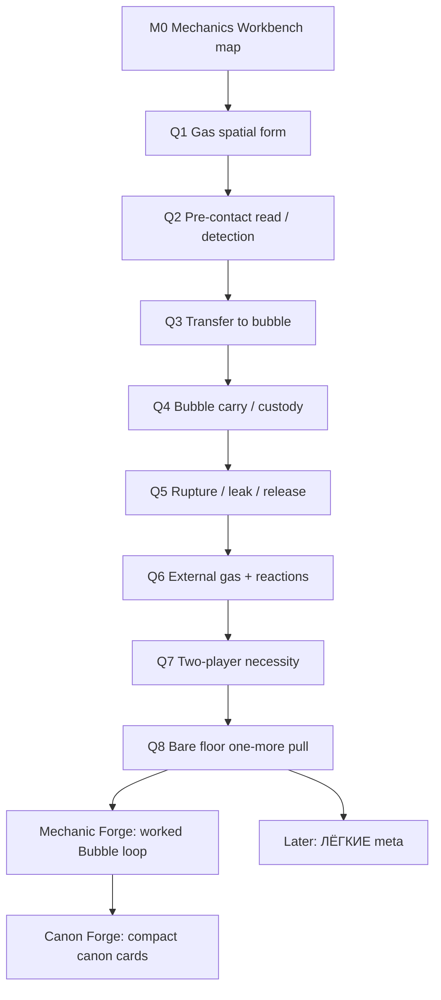

# Mechanics Workbench Question Map Seed v0

Status: cartography seed, not owner-approved map, not canon.
Purpose: migrate Mechanics Workbench drafts into the normal canon/design question-map shape before any next one-question session starts.

## 1. Why this seed exists

The owner corrected the route:

> Do not run a random Design Lab from a draft queue. First build the proper map, make sure nothing is lost, then choose the next one-question CALL through the established process.

This file is the seed for `local/canon-cartography`.
It is not the final map.

## 2. Source migration inventory

Every item below must be accounted for by the cartography session.

### Current floor-proof candidate

- `Пузырь` / visible gas custody:
  - players transfer some gas into a visible fragile bubble;
  - carry it out;
  - rupture returns gas to the world;
  - must not imply exact membrane/tool/container yet.

### Parked meta

- `ЛЁГКИЕ`:
  - base air and extracted value are one substance;
  - `ДЫШАТЬ / ПРОДАТЬ`;
  - visible base machine/refiner and glass air tank as a no-menu meta image;
  - `Кессон` / base as the smallest floor using the same gas logic;
  - expedition cost burns base air; recovered gas can become air or corporate money;
  - debt / air-in-credit / shift rhythm / corporate waiting;
  - no hard Game Over: failure spends air and leaves value below, debt creates comeback;
  - campaign-level mass-conservation fantasy;
  - parked until floor value, custody and replay pull exist.

### Required floor/blocker topics

- gas spatial form;
- detection/read before contact;
- transfer-to-bubble action;
- carry/body/co-op;
- rupture/leak/release;
- reactions and external gas;
- two-player necessity;
- bare-floor one-more pull.

### Preserved candidate seeds

- quiet/sleep floor as non-magical low-activity state;
- flagship gas examples as behavior jobs only;
- building as gas tool: doors, vents, height, holes, pressure, route;
- tools/instruments as future sockets;
- mission-value-first as paper fallback only;
- old canon/gas-interaction map as salvage, not authority;
- title `ОНО ДЫШИТ` as working label only.

### Explicitly banned as ready terms

- `газовый карман`;
- `запузырить`;
- exact `мембранное кольцо`;
- magical sleep/wake aggro;
- gas subjectivity / creature AI.

## 3. Proposed question graph

## 4. Candidate nodes

### M0 — Mechanics Workbench map

plain_question:
  What is the correct question map and route for turning the current Bubble/Workbench drafts into normal one-question sessions without losing parked ideas?

why_it_matters:
  Without this, a draft queue can pretend to be the official process. The owner should not have to browse files or accept a random next Design Lab.

answer_shape:
  taxonomy

status:
  ready

dependency_type:
  hard_prerequisite

blocks:
  - Q1 gas spatial form
  - any mechanic-forge
  - any canon-forge
  - `ЛЁГКИЕ` meta session

do_not_solve_here:
  - actual gas spatial answer
  - transfer mechanic
  - carry mechanic
  - exact reactions
  - economy
  - canon freeze

needs_anchor:
  map_table

confusion_traps:
  - treating draft files as process
  - skipping owner-facing cartography
  - starting Design Lab before route is accepted
  - losing parked ideas

forge_handoff:
  plain_question: "Какой вопрос следующий и каким play он должен идти?"
  why_now: "Workbench exists, but the owner rejected ad-hoc route and file-browsing."
  must_decide:
    - accepted question map
    - first next question
    - first next play: Design Lab vs Mechanic Forge vs Canon Forge
    - parked idea accounting
  must_not_decide:
    - answers to gameplay questions
    - exact mechanics
    - canon content
  parent_locks:
    - one question per session
    - owner-facing plain question
    - no canon freeze from drafts
  expected_answer_shape: taxonomy
  first_owner_question: "Эта карта покрывает все, что нельзя потерять, и правильный ли первый вопрос?"
  return_to_graph_if:
    - owner says a major idea is missing
    - next question is not plain
    - play route is unclear

### Q1 — Gas spatial form

plain_question:
  In the first Bubble proof, when we say "there is gas here", what exists in space?

why_it_matters:
  Transfer-to-bubble is meaningless until the gas has a first-proof spatial form.

answer_shape:
  scenario_grammar

status:
  needs_preface

dependency_type:
  hard_prerequisite

blocks:
  - Q2 detection/read
  - Q3 transfer-to-bubble
  - Q4 carry sizing/behavior
  - Q5 rupture/release
  - Q6 reactions

do_not_solve_here:
  - exact transfer tool
  - exact bubble physics
  - full gas roster
  - final VFX

needs_anchor:
  verbal_scene

confusion_traps:
  - saying "газовый карман" without definition
  - making gas only a pickup spot
  - making gas fully obvious or unfairly invisible

forge_handoff:
  plain_question: "В первом proof газ существует как слой, объем, поток, источник, видимое озеро, следовая концентрация или комбинация?"
  why_now: "This is the first blocker behind Bubble proof."
  must_decide:
    - first-proof spatial model
    - what variants are rejected or parked
  must_not_decide:
    - capture device
    - carry controls
    - economy
  parent_locks:
    - gas is field/system, not creature AI
    - visible/readable consequence matters
  expected_answer_shape: scenario_grammar
  first_owner_question: "Что игрок физически видит/подозревает в комнате до bubble?"
  return_to_graph_if:
    - question splits into source/flow vs resting layer
    - answer depends on a detection decision first

### Q2 — Pre-contact read / detection

plain_question:
  What do players read before they touch or disturb the gas?

why_it_matters:
  The first proof must be fair without a wiki and without making gas obvious from the door.

answer_shape:
  visual_plate

status:
  downstream

dependency_type:
  downstream

blocks:
  - transfer action fairness
  - instrument role
  - tutorial/no-tutorial
  - greybox readability

do_not_solve_here:
  - final scanner UI
  - gas names
  - full diagnosis system

needs_anchor:
  visual/verbal scene

confusion_traps:
  - detection only as HUD number
  - invisible unfair death
  - Phasmophobia journal-guessing as whole mission

### Q3 — Transfer to bubble

plain_question:
  What physical player action moves part of the gas into a visible bubble?

why_it_matters:
  This replaces undefined words like `запузырить`.

answer_shape:
  scenario_grammar

status:
  downstream

dependency_type:
  downstream

blocks:
  - carry
  - capture risk
  - co-op roles
  - tool placeholder

do_not_solve_here:
  - exact final tool art
  - full container system
  - economy

needs_anchor:
  player-action scene

confusion_traps:
  - exact membrane ring becomes canon too early
  - vacuum/progress-bar boring action
  - capture ignores gas-field behavior

### Q4 — Bubble carry / custody

plain_question:
  Once the bubble exists, what do players physically do to carry, steer, protect or pass it through the route?

why_it_matters:
  The proof lives or dies on body/co-op action, not on container stats.

answer_shape:
  loop_spine

status:
  downstream

dependency_type:
  downstream

blocks:
  - co-op proof
  - route design
  - failure triggers
  - mechanic-forge readiness

do_not_solve_here:
  - exact controls
  - final tuning
  - full cargo system

needs_anchor:
  separated-player scenario

confusion_traps:
  - one player just slow-walks
  - two players do identical work
  - bubble is generic fragile item

### Q5 — Rupture / leak / release

plain_question:
  What happens in the world when the bubble leaks, ruptures, or players release it?

why_it_matters:
  Failure must become a new gas situation, not a score penalty.

answer_shape:
  scenario_grammar

status:
  downstream

dependency_type:
  downstream

blocks:
  - recovery
  - return liability
  - reactions
  - replay pull

do_not_solve_here:
  - exact damage numbers
  - full reaction table
  - full death/revive rules

needs_anchor:
  failure scene

confusion_traps:
  - cargo durability loss only
  - gas disappears
  - random unavoidable disaster

### Q6 — External gas + reactions

plain_question:
  How can external gas/conditions/reactions affect the bubble and released contents in the first proof?

why_it_matters:
  Reactions are already a core system and must not be forgotten, but first proof cannot become a full chemistry table.

answer_shape:
  scenario_grammar

status:
  downstream

dependency_type:
  co_frame

blocks:
  - failure consequence
  - route risk
  - engine/design sync

do_not_solve_here:
  - all gas pairs
  - exact reaction outcomes
  - exact damage

needs_anchor:
  one readable reaction case

confusion_traps:
  - N^2 table
  - reaction as random explosion
  - ignoring external gas

### Q7 — Two-player necessity

plain_question:
  Why does this loop require two real players in the moment?

why_it_matters:
  If one player can do the loop with enough time, the mechanic fails the anti-solo lens.

answer_shape:
  proof

status:
  downstream

dependency_type:
  downstream

blocks:
  - mechanic-forge
  - greybox criteria

do_not_solve_here:
  - matchmaking
  - class roles
  - full revive system

needs_anchor:
  separated-player scenario

confusion_traps:
  - two players do same thing faster
  - one player can sequentially perform both halves
  - forced role UI instead of live coupling

### Q8 — Bare floor one-more pull

plain_question:
  Does the bare floor loop create "one more try" before meta/economy?

why_it_matters:
  `ЛЁГКИЕ` should amplify replay pull, not create it from nothing.

answer_shape:
  proof

status:
  downstream

dependency_type:
  downstream

blocks:
  - `ЛЁГКИЕ`
  - base/economy
  - run structure

do_not_solve_here:
  - meta numbers
  - debt tuning
  - shifts

needs_anchor:
  run-end scene

confusion_traps:
  - meta bribes weak floor
  - grind treadmill
  - "one more" only through numbers

## 5. Later parked nodes

### L1 — `ЛЁГКИЕ` meta

plain_question:
  If the floor loop already creates value and one-more pull, how does the base-air meta amplify it?

status:
  parked

dependency:
  after Q8 at minimum.

must_preserve:
  `ДЫШАТЬ / ПРОДАТЬ`, visible air tank, base/refiner machine, debt, shift rhythm, corporate waiting, base as small floor, no abstract quota by default, no hard Game Over by default, mass-conservation fantasy at campaign level.

### L2 — Gas jobs / flagship roster

plain_question:
  Which gas behavior jobs are needed after the proof loop is clear?

status:
  parked

must_preserve:
  candidate examples only: `Тихоня`, `Сквозняк`, `Вспышка`, `Разлив`, `Руки`, `Хор`.

### L3 — Title / pitch

plain_question:
  What title/pitch label follows the proven mechanic?

status:
  parked

must_preserve:
  `ОНО ДЫШИТ` may remain working title; title must not drive mechanics.

## 6. Recommended cartography output

The next cartography session should return:

- owner-approved / owner-corrected question map;
- accounting table showing each source idea is placed or intentionally dropped;
- first next CALL selected through the map;
- explicit route: Design Lab vs Mechanic Forge vs Canon Forge;
- no canon freeze.

END_OF_FILE: live/indie-game-development/work/canon-maps/mechanics-workbench-question-map-seed-v0.md
