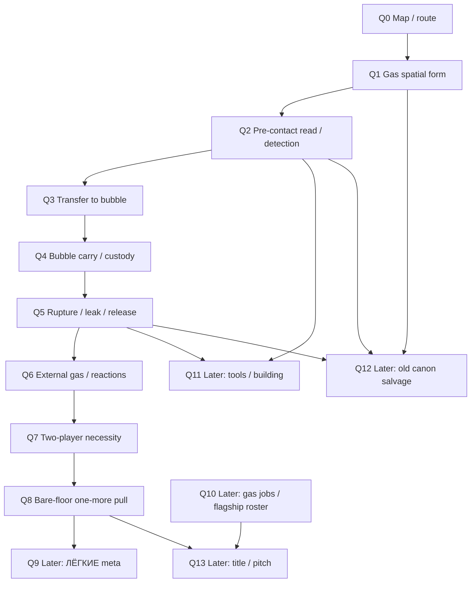

# Mechanics Workbench Question Map v0.1

Status: owner-approved cartography map, not canon, no gameplay answer frozen.
Approved in: `s-cartography-mechanics-workbench-questions-001`.
Owner words: `вариант A`.

## 1. Cluster

Cluster: Mechanics Workbench / Bubble-first floor proof.

Anchor question:
  Which one-question route turns the current Bubble / floor-proof / meta drafts into normal Direction OS sessions without losing material?

Why this map exists:
  The owner rejected an ad-hoc jump into Q1 Design Lab. The correct process is maps first, then one chat-first question at a time.

Current route decision:
  First next route is `local/design-lab` for `q-first-proof-gas-spatial-form`.

Rejected routes:
  - `local/mechanic-forge` now: too early; no worked playable loop exists yet.
  - `local/canon-forge` now: too early; no freeze-ready canon question exists yet.
  - repair now: not needed; the map is owner-approved.
  - another cartography split now: not needed unless a future session finds a missing major idea.

Route hypothesis verified:
  - Design Lab clears unclear blockers.
  - Mechanic Forge later freezes a worked playable mechanic loop.
  - Canon Forge later freezes compact canon only when freeze-ready.

## 2. Accounting table

| Source idea | Disposition | Map home | Reason |
|---|---|---|---|
| `Пузырь` / visible gas custody | placed | Q1-Q7 | Current floor-proof candidate; not canon, not a solved mechanic. |
| `ЛЁГКИЕ` | parked | Q9 | Depends on bare floor value, custody and one-more pull. |
| quiet / sleep floor | placed | Q1-Q2 | Low-activity/read phase only; not magic sleep/aggro. |
| detection / pre-contact read | placed | Q2 | Needs spatial form first. |
| reactions / release | placed | Q5-Q6 | Failure returns gas to world state; reactions must not be forgotten. |
| carry / body co-op | placed | Q4/Q7 | Needs bubble/custody shape before anti-solo proof. |
| flagship examples | parked | Q10 | Behavior jobs/examples only, not roster canon. |
| tools / instruments / building as gas tool | placed as sockets | Q11 | Keep doors, vents, height, pressure and tools as later route/control questions. |
| old canon / gas-interaction map | salvage | Q12 | Evidence/vocabulary only; not authority. |
| title `ОНО ДЫШИТ` | parked | Q13 | Working label only; title follows proof. |
| mission-value-first | rejected-for-now as active route | Q0 note | Paper fallback only; no second playable branch now. |

## 3. Graph

## 4. Nodes

### Q0 - Mechanics Workbench map

plain_question:
  Какая карта вопросов превращает drafts Workbench в нормальные one-question sessions?
why_it_matters:
  Without this, drafts can masquerade as process and parked ideas can disappear.
answer_shape: taxonomy
status: ready
dependency_type: hard_prerequisite
blocks:
  - Q1-Q13
do_not_solve_here:
  - gameplay answers
  - exact mechanics
  - canon freeze
needs_anchor: diagram
confusion_traps:
  - treating seed as owner-approved map
  - asking the owner to hunt through files
  - starting Q1 before route sign
route:
  complete in this cartography session; owner chose `вариант A`.
forge_handoff:
  plain_question: "Какой вопрос следующий и каким play он должен идти?"
  why_now: "The Workbench material exists, but the owner rejected ad-hoc route and file-browsing."
  must_decide: accepted map, first next question, first next play, parked idea accounting
  must_not_decide: gameplay answers, exact mechanics, canon content
  parent_locks: one question per session; owner-facing plain question; no canon freeze from drafts
  expected_answer_shape: taxonomy
  first_owner_question: "Эта карта покрывает всё, что нельзя потерять?"
  return_to_graph_if: major idea missing; next question is not plain; route is unclear

### Q1 - Gas spatial form

plain_question:
  В первом Bubble-proof, когда мы говорим "здесь есть газ", что существует в пространстве?
why_it_matters:
  Detection, transfer, carry sizing, release and reactions all depend on what exists before the bubble.
answer_shape: scenario_grammar
status: ready
dependency_type: hard_prerequisite
blocks:
  - Q2 detection/read
  - Q3 transfer-to-bubble
  - Q4 carry/custody
  - Q5 rupture/release
  - Q6 reactions
do_not_solve_here:
  - transfer tool
  - exact bubble physics
  - economy
  - roster
  - final VFX
needs_anchor: verbal_scene
confusion_traps:
  - `газовый карман` as a ready term
  - gas as pickup spot
  - fully obvious cloud or unfair invisible death
route:
  next `local/design-lab`.
forge_handoff:
  plain_question: "Что физически существует до пузыря: слой, объём, поток, источник, видимое озеро, следовая концентрация или другое?"
  why_now: "This is the earliest blocker behind Bubble proof."
  must_decide: first-proof spatial model; parked/rejected variants
  must_not_decide: capture device; carry controls; economy; final VFX
  parent_locks: gas is field/system, not creature AI; visible/readable consequence matters
  expected_answer_shape: scenario_grammar
  first_owner_question: "Что игрок физически видит или подозревает в комнате до bubble?"
  return_to_graph_if: question splits into source/flow vs resting layer; answer depends on detection first

### Q2 - Pre-contact read / detection

plain_question:
  Что игроки читают до касания или нарушения газа?
why_it_matters:
  The first proof must be fair without a wiki and without making gas obvious from the door.
answer_shape: visual_plate
status: downstream
dependency_type: downstream
blocks:
  - transfer action fairness
  - instrument role
  - tutorial/no-tutorial
  - greybox readability
do_not_solve_here:
  - final scanner UI
  - gas names
  - full diagnosis system
needs_anchor: visual_plate
confusion_traps:
  - HUD number only
  - invisible unfair death
  - Phasmophobia journal-guessing as the whole loop
route:
  `local/design-lab` after Q1.
forge_handoff:
  plain_question: "Какие признаки говорят игрокам, что газ есть и как с ним можно действовать?"
  why_now: "The read depends on spatial form."
  must_decide: first-proof read channels
  must_not_decide: final UI; full diagnosis; gas roster
  parent_locks: field-read must be perceivable before irreversible consequence
  expected_answer_shape: visual_plate
  first_owner_question: "Что честно видно/слышно/меряется до первого действия?"
  return_to_graph_if: read requires final VFX/UI or exact gas names

### Q3 - Transfer to bubble

plain_question:
  Каким физическим действием часть газа становится видимым пузырём?
why_it_matters:
  This replaces undefined words like `запузырить`.
answer_shape: scenario_grammar
status: downstream
dependency_type: downstream
blocks:
  - Q4 carry
  - capture risk
  - co-op roles
  - tool placeholder
do_not_solve_here:
  - exact final tool art
  - full container system
  - economy
needs_anchor: verbal_scene
confusion_traps:
  - exact membrane ring becomes canon too early
  - vacuum/progress-bar action
  - capture ignores field behavior
route:
  `local/design-lab` after Q1/Q2.
forge_handoff:
  plain_question: "Что игрок реально делает, чтобы перевести часть газа в bubble?"
  why_now: "Carry/custody cannot be discussed until bubble creation is physically understandable."
  must_decide: action grammar; rejected placeholders
  must_not_decide: final equipment; prices; full container taxonomy
  parent_locks: visible custody; no magic item tag
  expected_answer_shape: scenario_grammar
  first_owner_question: "Игроки собирают газ, обводят область, создают объём, тянут поток или делают другое?"
  return_to_graph_if: transfer depends on unknown spatial/read decisions

### Q4 - Bubble carry / custody

plain_question:
  Когда пузырь уже есть, что игроки телом делают, чтобы нести, вести, защищать или передавать его?
why_it_matters:
  The proof lives or dies on body/co-op action, not container stats.
answer_shape: loop_spine
status: downstream
dependency_type: downstream
blocks:
  - Q7 two-player proof
  - route design
  - failure triggers
  - mechanic-forge readiness
do_not_solve_here:
  - exact controls
  - final tuning
  - full cargo system
needs_anchor: verbal_scene
confusion_traps:
  - one player slow-walks
  - two players do identical work
  - bubble is generic fragile cargo
route:
  `local/design-lab` first; later `local/mechanic-forge` when loop is worked.
forge_handoff:
  plain_question: "Какая moment-to-moment carry/custody петля появляется после создания bubble?"
  why_now: "This is the body/co-op heart of the proof."
  must_decide: carry duties; route constraints; custody readability
  must_not_decide: exact tuning; final controls; content volume
  parent_locks: not-solo extraction; visible gas custody
  expected_answer_shape: loop_spine
  first_owner_question: "Почему игроки спорят/говорят во время переноса?"
  return_to_graph_if: carry reduces to ordinary cargo handling

### Q5 - Rupture / leak / release

plain_question:
  Что происходит в мире, когда пузырь течёт, рвётся или игроки выпускают газ?
why_it_matters:
  Failure must create a new gas situation, not a score penalty.
answer_shape: scenario_grammar
status: downstream
dependency_type: downstream
blocks:
  - Q6 reactions
  - recovery
  - return liability
  - replay pull
do_not_solve_here:
  - exact damage numbers
  - full reaction table
  - death/revive rules
needs_anchor: verbal_scene
confusion_traps:
  - gas disappears
  - cargo durability loss only
  - random unavoidable disaster
route:
  `local/design-lab`.
forge_handoff:
  plain_question: "Как release меняет комнату, маршрут, людей или остаточную ценность?"
  why_now: "The Bubble promise depends on failure returning gas to the world."
  must_decide: failure grammar; recoverability boundaries
  must_not_decide: exact HP; full reactions; tuning
  parent_locks: release changes world; release can sometimes be correct play
  expected_answer_shape: scenario_grammar
  first_owner_question: "Если bubble лопнул здесь, что игроки теперь должны читать/делать?"
  return_to_graph_if: failure cannot be attributed or recovered at paper level

### Q6 - External gas / reactions

plain_question:
  Как внешний газ, условия или реакция влияют на bubble и released contents в первом proof?
why_it_matters:
  Reactions are core material, but first proof must not become an N^2 chemistry table.
answer_shape: scenario_grammar
status: downstream
dependency_type: co_frame
blocks:
  - failure consequence
  - route risk
  - engine/design sync
do_not_solve_here:
  - all gas pairs
  - exact reaction outcomes
  - exact damage
needs_anchor: verbal_scene
confusion_traps:
  - N^2 table
  - random explosion
  - ignoring external gas
route:
  `local/design-lab`, co-framed with Q5 if needed.
forge_handoff:
  plain_question: "Какой один reaction/external-gas case обязан быть понятен для Bubble proof?"
  why_now: "Release and carry cross external gas by definition."
  must_decide: finite first-proof reaction situation
  must_not_decide: full roster/table/damage
  parent_locks: reactions as readable player decisions; no pairwise table first
  expected_answer_shape: scenario_grammar
  first_owner_question: "Что страшнее/важнее первым: внешнее поле портит bubble или released gas reacts with room gas?"
  return_to_graph_if: reaction design becomes table-first

### Q7 - Two-player necessity

plain_question:
  Почему этот loop требует двух реальных игроков в моменте?
why_it_matters:
  If one player can do the loop sequentially, it fails the anti-solo lens.
answer_shape: proof
status: downstream
dependency_type: downstream
blocks:
  - mechanic-forge
  - greybox criteria
do_not_solve_here:
  - matchmaking
  - class roles
  - full revive system
needs_anchor: greybox
confusion_traps:
  - two players merely do the same thing faster
  - one skilled player can perform both halves sequentially
  - forced role UI replaces live coupling
route:
  paper pass in Design Lab; later `local/mechanic-forge`; greybox later.
forge_handoff:
  plain_question: "Что один игрок не может сделать с достаточным временем?"
  why_now: "Mechanic Forge should not receive a soloable loop."
  must_decide: anti-solo refutation targets
  must_not_decide: class system; matchmaking; final revive
  parent_locks: mechanic lenses 3/4/6
  expected_answer_shape: proof
  first_owner_question: "Где live shared-state coupling forces speech or rescue?"
  return_to_graph_if: proof is only 'faster together'

### Q8 - Bare-floor one-more pull

plain_question:
  Даёт ли голый floor loop желание "ещё раз" до meta/economy?
why_it_matters:
  `ЛЁГКИЕ` should amplify replay pull, not create it from nothing.
answer_shape: proof
status: proof_later
dependency_type: proof_downstream
blocks:
  - Q9 `ЛЁГКИЕ`
  - base/economy
  - run structure
do_not_solve_here:
  - meta numbers
  - debt tuning
  - shift structure
needs_anchor: greybox
confusion_traps:
  - meta bribes a weak floor
  - grind treadmill
  - "one more" only through numbers
route:
  after Q1-Q7; paper proof then greybox route.
forge_handoff:
  plain_question: "После одной попытки игроки хотят повторить из-за floor situation itself?"
  why_now: "Meta should not hide a dead floor."
  must_decide: replay-pull evidence target
  must_not_decide: economy/base/debt
  parent_locks: mechanic lens 6 is binding for fun
  expected_answer_shape: proof
  first_owner_question: "Что они хотят сделать лучше на второй попытке?"
  return_to_graph_if: replay pull exists only in meta reward

### Q9 - `ЛЁГКИЕ` meta

plain_question:
  Если floor loop уже даёт value и one-more, как база-воздух усиливает это?
why_it_matters:
  It is a strong meta idea, but early economy would dictate mechanics prematurely.
answer_shape: economy_model
status: blocked
dependency_type: economy_downstream
blocks:
  - base
  - debt
  - shift rhythm
  - global loop
do_not_solve_here:
  - economy tuning now
  - hard Game Over
  - exact prices
needs_anchor: verbal_scene
confusion_traps:
  - meta before floor proof
  - abstract quota replaces gas
  - numbers swallow loop discussion
route:
  parked until Q8 at minimum.
forge_handoff:
  plain_question: "Как `ДЫШАТЬ / ПРОДАТЬ` amplifies a proven floor loop?"
  why_now: "Only after floor value/replay pull exists."
  must_decide: base-air choice shape
  must_not_decide: exact tuning; full campaign economy
  parent_locks: one substance; no hard Game Over by default; base as smallest floor remains only a later candidate
  expected_answer_shape: economy_model
  first_owner_question: "Как visible air tank pressures the next run without menus?"
  return_to_graph_if: meta starts solving floor fun

### Q10 - Gas jobs / flagship roster

plain_question:
  Какие gas behavior jobs нужны после proof loop?
why_it_matters:
  Flagships are useful as jobs and hook examples, but a roster now would become cool exceptions.
answer_shape: taxonomy
status: blocked
dependency_type: downstream
blocks:
  - gas catalog
  - visual identity
  - marketing examples
do_not_solve_here:
  - exact roster
  - names as canon
  - prices
  - all reactions
needs_anchor: verbal_scene
confusion_traps:
  - creature AI
  - name-first design
  - chemistry taxonomy before gameplay jobs
route:
  parked until Q1-Q8 clarify the proof.
forge_handoff:
  plain_question: "Which behavior jobs make the proven loop richer?"
  why_now: "Only after the loop says what jobs are needed."
  must_decide: jobs, not full roster
  must_not_decide: exact names/prices/table
  parent_locks: gas may look alive but has no intent/targeting by default
  expected_answer_shape: taxonomy
  first_owner_question: "Which job is missing from the proof: scare, rescue, route, value, reaction, tool?"
  return_to_graph_if: roster becomes list of cool exceptions

### Q11 - Tools / building as gas tool

plain_question:
  Какие роли у здания и инструментов как gas-control sockets?
why_it_matters:
  Doors, vents, height, holes, pressure and route keep gas interactive before final tools exist.
answer_shape: equipment_model
status: downstream
dependency_type: co_frame
blocks:
  - read
  - transfer
  - route control
  - utility actions
do_not_solve_here:
  - scanner UI
  - loadout
  - upgrades
  - exact membrane ring
needs_anchor: verbal_scene
confusion_traps:
  - gadget solves danger for free
  - tool list before verb
  - building becomes static backdrop
route:
  later Design Lab / Mechanic Forge depending on verb readiness.
forge_handoff:
  plain_question: "What can players use in the level before a final tool list exists?"
  why_now: "The proof needs route/control sockets, but not equipment canon."
  must_decide: tool/building roles
  must_not_decide: exact loadout/progression/prices
  parent_locks: gas control should cost value, route, time or rescue margin
  expected_answer_shape: equipment_model
  first_owner_question: "Which socket is first: door, vent, height, pressure, cold/heat, temporary instrument?"
  return_to_graph_if: utility cancels danger for free

### Q12 - Old canon salvage

plain_question:
  Какие старые элементы возвращаются, потому что нужны текущему blocker?
why_it_matters:
  Old material has useful vocabulary, but can hide unclear mechanics by sounding authoritative.
answer_shape: taxonomy
status: downstream
dependency_type: downstream
blocks:
  - canon-forge readiness
  - terminology
do_not_solve_here:
  - blind migration
  - old ontology
  - old canon as authority
needs_anchor: none
confusion_traps:
  - old map as law
  - stale terms hiding current unknowns
  - importing archive because it exists
route:
  later cartography/canon-forge only when a current blocker needs it.
forge_handoff:
  plain_question: "Which old term earns re-entry by helping the current question?"
  why_now: "Only when a blocker needs vocabulary/evidence."
  must_decide: salvage item and reason
  must_not_decide: broad migration
  parent_locks: archive is evidence-only
  expected_answer_shape: taxonomy
  first_owner_question: "What current blocker does this old piece answer?"
  return_to_graph_if: salvage starts driving design

### Q13 - Title / pitch boundary

plain_question:
  Какой label продаёт уже proven mechanic?
why_it_matters:
  Title should follow proof; otherwise it starts pulling ontology and mechanics.
answer_shape: invariant
status: blocked
dependency_type: downstream
blocks:
  - marketing wording
  - public pitch
do_not_solve_here:
  - final title
  - living-city truth
  - gas subjectivity
needs_anchor: none
confusion_traps:
  - `ОНО ДЫШИТ` authorizes creature AI
  - title drives mechanics
  - marketing copy as canon
route:
  parked until proof/title relation is meaningful.
forge_handoff:
  plain_question: "What title follows the proven mechanic?"
  why_now: "Only after proof creates the fantasy."
  must_decide: label boundary
  must_not_decide: ontology or final public marketing before proof
  parent_locks: title follows proof; gas is not subject/creature AI by default
  expected_answer_shape: invariant
  first_owner_question: "Does the label describe what players actually do?"
  return_to_graph_if: title begins deciding mechanics

## 5. Next selected CALL

Selected:
  `c-designlab-gas-spatial-form-001`.

Why:
  Q1 is the earliest hard prerequisite. It does not solve the Bubble loop; it only decides what "gas is here" means in the first proof.

Gap rule:
  If the next Design Lab finds a hidden prerequisite, unclear plain question, wrong answer shape, visual/proof need, missing idea, or the owner says the session is going the wrong way, it checkpoints and returns to this map instead of inventing canon.

END_OF_FILE: live/indie-game-development/work/canon-maps/mechanics-workbench-question-map-v0.1.md
