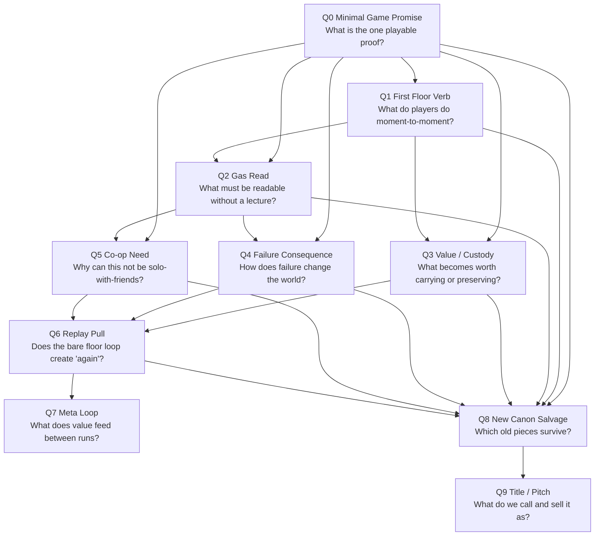

# Design Lab - Minimal Game Discussion Graph

Status: work note, not canon.
Session: `s-designlab-minimal-game-discussion-graph-001`
Input: owner rejected the last discussion flow as low-value/unprofessional and asked to set up a better way to discuss current liked mechanics and new ideas.
Direction: `indie-game-development`
Node: `g-d3a8`
Play: `local/design-lab`

## 1. Что чинится

Плохой паттерн последних сообщений:

- начали сравнивать ветки раньше, чем был назван один минимальный proof;
- идеи стали звучать как решения, хотя владелец прямо говорит: это пока просто идеи;
- старый canon использовался как авторитет, хотя текущая работа требует нового обсуждения;
- обсуждение ушло в неважные выборы и "две механики", вместо графа блокеров;
- side-ideas не парковались нормально и поэтому лезли в текущий спор.

Новый процесс должен обсуждать не "какой концепт выбрать", а:

> какая минимальная игра должна существовать, какие вопросы блокируют другие, и куда складывать идеи, которые могут пригодиться позже.

## 2. Новый контракт обсуждения

1. **Минимальная игра прежде канона.**
   Сначала обсуждаем playable proof, потом новый canon. Старый canon - evidence/salvage, не закон.

2. **Один текущий blocker.**
   В каждом разговоре есть один главный вопрос. Всё, что не отвечает на него, уходит в parking lot.

3. **Идея не решение.**
   `Пузырь`, `Лёгкие`, флагманские газы, база, экономика, title - это кандидаты. Они получают место в графе, но не становятся canon автоматически.

4. **Никаких двух playable branches ради сравнения.**
   Если надо проверить механику, proof строится вокруг одного loop. Альтернативы остаются paper fallback, пока текущий blocker не провален.

5. **Не обсуждаем downstream раньше времени.**
   Пока не доказан минимальный floor loop, не решаем экономику, progression, полный gas roster, exact tools, final VFX, timers, баланс или title ontology.

6. **Каждая идея переводится в gameplay claim.**
   Формат: что игрок хочет / видит / делает / чем рискует / что меняется. Без этого идея не участвует в графе.

7. **Side ideas сохраняются.**
   Хорошая идея, которая не отвечает текущему blocker, не спорится и не выбрасывается. Она пишется как parked concept with dependency.

## 3. Рабочая формула минимальной игры

Не canon. Это стартовая рамка для первого нормального обсуждения:

> Два игрока заходят в маленький floor cluster, читают один опасный gas state, делают с ним один ценный physical action, получают видимую custody/value, несут это через ухудшающийся маршрут, ошибаются так, что газ возвращается в мир, и после выхода/провала спорят "ещё один заход или хватит".

Минимальная игра обязана доказать:

- газ сам является предметом желания, а не фоном;
- игроки понимают gas danger без длинного обучения;
- действие с газом создаёт readable risk/reward;
- два игрока нужны не декоративно;
- провал меняет мир, а не просто списывает очки;
- после одной попытки возникает replay pull.

## 4. Parking lot идей

### `Пузырь`

Type: candidate for first floor proof / custody loop.

Gameplay claim:
players wrap visible gas in fragile membrane custody and carry it out; rupture releases gas back into the world.

Dependency:
blocked by Q0/Q1/Q2/Q3/Q4/Q5 below. It should be discussed as one possible minimal proof loop, not as canon title or final container system.

Why it is strong:
simple childhood affordance, visible gas, physical co-op, failure is world-changing.

Do not solve now:
exact membrane ring, soft-body tech, bubble physics, containers, economy, gas roster.

### `Лёгкие`

Type: meta-loop / base economy candidate.

Gameplay claim:
gas value and breathing value are one substance; every run consumes air, and returned gas can become air or money.

Dependency:
blocked by Q6 and Q7. It assumes the floor loop already makes gas value desirable and measurable.

Why it is strong:
one machine, two levers, no abstract quota, "money is air you chose not to breathe".

Why not now:
discussing it before the floor proof risks tuning economy around a loop that may not yet be fun.

### Sleep / wake floor

Type: floor tension model.

Gameplay claim:
the floor starts quiet/readable; player action wakes or worsens the gas state; greed creates escalation.

Dependency:
supports Q1/Q2/Q4, but must stay cheap in first proof.

Do not solve now:
global timers, exact wake thresholds, all trigger classes.

### Flagship gas personalities (`Хор`, `Сквозняк`, `Тихоня`, etc.)

Type: content / gas identity candidates.

Gameplay claim:
gas can feel like a monster without creature AI because field behavior has readable character.

Dependency:
blocked by Q2 and Q8. For first proof, use one behavior only.

Do not solve now:
full roster, exact names, final taxonomy.

### Old gas-interaction canon/map

Type: salvage source.

Useful because:
it contains good vocabulary: field read, state-window, reaction front, custody, return liability, no creature AI.

Problem:
it is too broad for current discussion and can pull the team back into labels instead of minimal game.

Use:
only as evidence when a current blocker needs a term.

## 5. Blocker graph

## 6. Вопросы графа

### Q0 - Minimal Game Promise

Question:
What is the one smallest playable proof that would make the owner say "this is the game"?

Blocks:
everything.

Bad discussion:
choosing between concepts, names, canon branches or meta systems.

Good discussion:
one loop, one scene, two players, what they do, what they argue about, what can fail.

Recommendation:
start here.

### Q1 - First Floor Verb

Question:
What do players actually do for the first 60-180 seconds of play?

Blocks:
tools, controls, level, gas type, custody, co-op roles.

Good answer shape:
player wants / sees / does / risks / changes.

### Q2 - Gas Read

Question:
What must players read to make the action fair and exciting?

Blocks:
visuals, field legibility, gas identity, danger, clip readability.

Bad:
HUD number, lore explanation, hidden table.

### Q3 - Value / Custody

Question:
What is the valuable thing before economy exists?

Blocks:
capture, carry, `Лёгкие`, extraction, return liability.

Good:
visible custody or state-window that players care about before prices.

### Q4 - Failure Consequence

Question:
When players fail, what happens in the room?

Blocks:
replay pull, trust in sim, cargo accident, rescue.

Good:
failure releases/changes gas and creates a new situation.

Bad:
score penalty, "you lose", hidden durability loss.

### Q5 - Co-op Need

Question:
Why does the loop need two real people in the moment?

Blocks:
first grey-box proof.

Good:
one player cannot read/hold/carry/control/rescue at the same time.

Bad:
two players merely do the same thing faster.

### Q6 - Replay Pull

Question:
After one bare floor attempt, do players want another without meta bribery?

Blocks:
`Лёгкие`, shift/economy/progression.

Good:
"we know how to do it now", "one more bubble", "we almost got it".

### Q7 - Meta Loop

Question:
What does returned value feed between runs?

Blocks:
`Лёгкие`, base, debt, credits, progression.

Rule:
do not discuss until Q0-Q6 have at least a paper-clean proof candidate.

### Q8 - New Canon Salvage

Question:
Which old canon pieces survive because the minimal game needs them?

Blocks:
canon-forge.

Rule:
old canon is not authority. It must earn re-entry by serving Q0-Q7.

### Q9 - Title / Pitch

Question:
What label sells the proven minimal game?

Blocks:
marketing wording.

Rule:
title follows proof. `ОНО ДЫШИТ` may stay as working label only.

## 7. First next discussion

Recommended next session:

> Q0/Q1 - define the single minimal playable proof.

Inputs allowed:

- `Пузырь` as strongest current custody candidate;
- sleep/wake floor as tension support;
- one flagship gas behavior as an example only;
- `Лёгкие` as parked meta pressure, not the thing being solved.

Hard boundaries:

- no economy;
- no `Лёгкие` tuning;
- no full gas roster;
- no title ontology;
- no old canon as authority;
- no two-prototype comparison;
- no exact tools/implementation;
- no fun claim before grey-box.

Expected output:

one owner-readable minimal proof loop and its blockers.

## 8. Route

Route:
continue with a focused Design Lab on Q0/Q1, using this graph as the guardrail.

No canon freeze.

END_OF_FILE: live/indie-game-development/work/design-labs/minimal-game-discussion-graph-001.md
