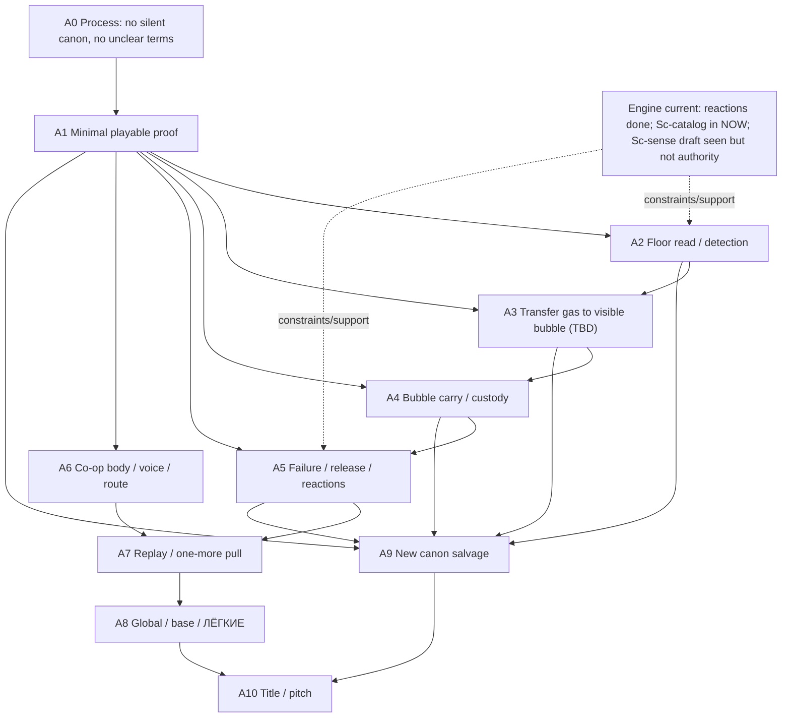

# Mechanics Workbench — Area Map v0

Status: рабочая карта, не canon.
Purpose: показать области игры, зависимости и что обсуждать сейчас / потом.

## 1. Области игры

### A0. Процесс обсуждения

Что решает:
как мы не повторяем плохой поток.

Сейчас:
активно. Без этого всё снова превратится в мутные термины и преждевременный canon.

Правило:
никакая идея не записывается как canon без review владельца и явного "можно записывать".

### A1. Минимальная игра / first proof

Что решает:
самый маленький loop, который влияет на разработку.

Сейчас:
главная область.

Рабочая формула:

> два игрока читают опасный gas state, получают видимую переносимую custody/value, несут через ухудшающийся маршрут, а ошибка возвращает газ в мир и меняет ситуацию.

Текущий candidate:
`Пузырь` как visible custody / carry proof.

### A2. Floor read / detection

Что решает:
как игроки понимают, где газ, что он делает, насколько опасен, что можно попробовать.

Сейчас:
блокирует first proof.

Важно:
газ не должен быть либо "полностью очевидное облако", либо "невидимая смерть". Нужны следы, приборы, движение, слой, звук, материал, pressure/temperature clues.

### A3. Transfer to visible custody

Что решает:
как часть газа становится переносимым пузырем.

Сейчас:
жесткий TBD.

Не решено:
это не "мембранное кольцо" как факт. Возможные будущие варианты:

- пустой bubble/tool всасывает часть газа;
- membrane создается вокруг выбранного объема;
- игроки сначала сгоняют газ в область, потом переводят в bubble;
- пузырь растет из переносимого устройства;
- другой вариант после обсуждения.

### A4. Bubble carry / custody

Что решает:
что игроки делают телом после появления пузыря.

Сейчас:
блокирует proof, но после A3.

Не решено:
один несет, двое держат, один толкает и второй стабилизирует, tether/handles, pushing/rolling, drag, lift, crouch, route squeeze, leak control.

### A5. Failure / release / reactions

Что решает:
что происходит при ошибке.

Сейчас:
обязательно включить в first proof discussion, потому что reactions уже важны и нельзя опять забыть.

Минимальная позиция:
если пузырь поврежден, газ не исчезает и не превращается в score penalty. Он выходит в мир здесь и сейчас.

Нужно обсудить:

- вышедший газ смешивается с внешним газом?
- внешнее поле повреждает пузырь?
- содержимое пузыря реагирует при разрыве?
- можно ли восстановиться / заново перевести в bubble?
- как игрок понимает причину провала?

### A6. Co-op body / voice / route

Что решает:
почему два человека нужны в моменте.

Сейчас:
блокирует proof. Если один игрок может сделать всё с двумя руками и временем, mechanic не проходит.

Candidate co-op:

- один читает маршрут/газ;
- один держит/ведет bubble;
- один открывает/закрывает route;
- один прикрывает от внешнего газа/reaction/front;
- один может спасать после release.

### A7. Replay / one more pull

Что решает:
возникает ли "еще один заход" без меты.

Сейчас:
проверяется после A1-A6 на бумаге, потом только greybox.

Важно:
`ЛЁГКИЕ` могут усилить one-more-run, но не должны создавать его вместо floor loop.

### A8. Global / base / meta

Что решает:
карты, выбор глубины, закупки, база, `ЛЁГКИЕ`, воздух, долг, смена.

Сейчас:
parked.

Почему:
если floor loop не держит gas value и replay pull, meta будет тюнить пустоту.

### A9. Canon salvage

Что решает:
что из старого canon возвращается.

Сейчас:
later. Старый canon не авторитет.

Принцип:
старый материал входит только если он нужен текущему blocker.

### A10. Title / pitch / marketing

Что решает:
как это назвать и продать.

Сейчас:
parked.

Граница:
`ОНО ДЫШИТ` может оставаться working title / pitch-label. Title follows proof.

## 2. Dependency graph

## 3. Current now / next / later

### Сейчас обсуждать

1. Minimal proof skeleton.
2. What exactly players read before action.
3. What "transfer into bubble" could mean, without deciding final tool.
4. What carry/custody asks from one/two players.
5. What release/reaction does on failure.

### После этого

1. First greybox cut.
2. Required engine/visual supports for proof.
3. Whether old canon pieces re-enter.
4. Whether `ЛЁГКИЕ` is the correct meta after floor loop.

### Не сейчас

- economy numbers;
- `ЛЁГКИЕ` tuning;
- full gas roster;
- final gas names;
- exact tools;
- exact membrane implementation;
- exact cargo/container system;
- final VFX/UI;
- title ontology;
- marketing copy.

## 4. Development sync

This map is design-side and does not change product road.

Known from `NOW.md`:

- Sc-reactions delivered and merged.
- Sc-catalog is the live active engine call in `NOW.md`.
- A local untracked `c-exec-035-sc-sense-call.md` exists and describes a possible Sc-sense foundation, but because it is untracked here it is not treated as applied Direction OS authority.

Design implication:

- reactions must be represented in the proof questions;
- player exposure/detection is important, but design must not assume Sc-sense is already official;
- no design doc should demand a final gas roster before the current floor proof is clear.

END_OF_FILE: live/indie-game-development/work/mechanics-workbench/area-map-v0.md
