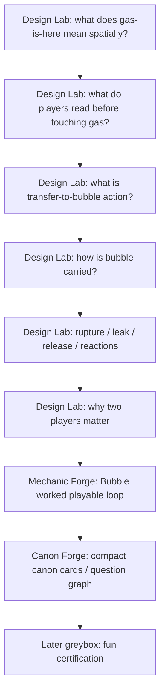

# Mechanics Workbench — Route To Forge v0

Status: route note, не canon.
Purpose: связать Mechanics Workbench с существующими Direction OS plays без костылей.

## 1. Главное

Workbench не заменяет Canon Forge и не является отдельной новой системой.

Правильный маршрут:

> Design Lab clarifies unclear gameplay blockers -> Mechanic Forge freezes a worked playable loop -> Canon Forge freezes compact canon cards only when a question is actually ready.

## 2. Почему не сразу Canon Forge

`local/canon-forge` хорошо подходит для canon card:

- один уже понятный вопрос;
- frozen parents known;
- owner picks direction;
- draft passes gates;
- owner signs;
- card freezes in canon repo.

Но текущие вопросы про `Пузырь` не такие.

Сейчас неясно:

- что значит "газ есть здесь";
- что игрок читает;
- что физически делает;
- как газ переходит в bubble;
- как bubble несут;
- как failure returns gas to world;
- как reactions входят;
- почему это не solo-with-friends.

Это не freeze-ready canon. Это gameplay/mechanic shaping.

## 3. Какой play для чего

### `local/design-lab`

Use when:
вопрос мутный, зависит от adjacent blockers, owner еще спорит с формулировкой, нужна карта вариантов.

Output:
owner-readable comparison / narrowed decision / next route.

Current use:
Q1 `q-first-proof-gas-spatial-form`.

### `local/mechanic-forge`

Use when:
мы уже понимаем вопрос и хотим зафиксировать mechanic as worked playable loop.

Why important:
в repo уже есть play specifically for mechanics. Он отличается от canon-forge тем, что deliverable = expanded moment-to-moment loop, verbs, units/seconds, 2-player requirement, mechanic lenses.

Expected later:
Bubble Carry / Transfer / Failure loop should go through mechanic-forge before canon card if it becomes a real mechanic.

### `local/canon-forge`

Use when:
worked mechanic or design invariant is ready to become compact canon.

Not for:
unclear terms, broad brainstorming, first-pass mechanics, unresolved blocker graph.

## 4. Current route

## 5. Tree status

No `TREE.md` change is required right now.

Reason:
`TREE.md` already has g-d3a8 as the design truth / canon track and names local/canon-forge as the canon process. The current repair is a route/state update inside that node, not a new top-level outcome.

If later the owner wants to restructure g-d3a8 into explicit child nodes like:

- minimal floor proof;
- bubble mechanic;
- meta/base;
- canon cards;
- greybox proof;

that should be a separate owner-approved `map` or `canon-cartography` session. Do not silently edit `TREE.md`.

## 6. NOW status

`NOW.md` must carry the next open design call, otherwise the process is not actually active.

Current open design call after this repair:

- `c-designlab-gas-spatial-form-001`

Primary `NOW.next` remains the engine CALL `c-exec-034`, because g-9c41 is still the primary active bet. But g-d3a8 parallel track must no longer say only "awaiting Bubble-first decision"; it must point to the chat-first Workbench route.

END_OF_FILE: live/indie-game-development/work/mechanics-workbench/route-to-forge-v0.md
